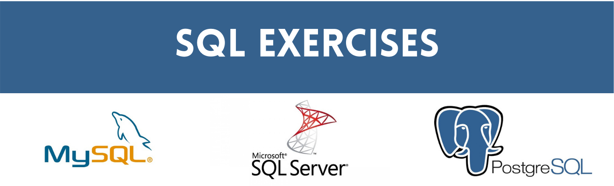

## Basic Queries

## Advanced Queries

## Database Design

## Error Handling

## Writing Functions and Stored Procedures

## Building and Optimizing Triggers in SQL Server

## Improving Query Performance in SQL Server

## [SQL Certificates](https://github.com/Promeos/SQL_Database_Exercises/tree/master/Certificates)
